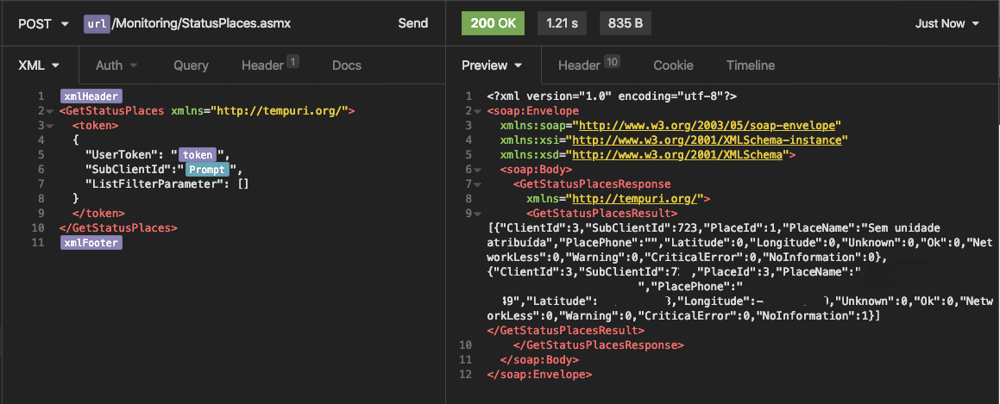
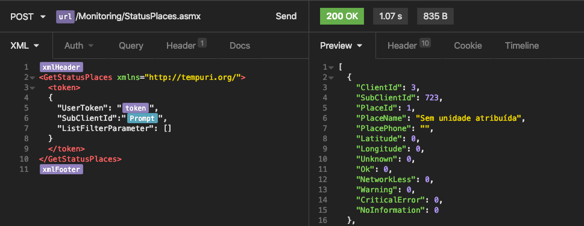

# Insomnia Plugin XML-JSON

<p align="center">

  <a href="https://www.linkedin.com/in/carlosgodri/">
    
  </a>
  
</p>

This plugin removes the XML tags from server responses that returns JSON within an XML.

### 🚀 Installation

- Access the Application / Preferences menu and then select the Plugins tab, enter the plugin name `insomnia-plugin-xml-json-response` and click Install Plugin.

- After installing the plugin click on enable

### Example

The format that the api returns to me is the following:

```xml
<?xml version="1.0" encoding="utf-8"?>
<soap:Envelope
  xmlns:soap="http://www.w3.org/2003/05/soap-envelope"
  xmlns:xsi="http://www.w3.org/2001/XMLSchema-instance"
  xmlns:xsd="http://www.w3.org/2001/XMLSchema">
  <soap:Body>
    <GetStatusPlacesResponse
      xmlns="http://tempuri.org/">
      <GetStatusPlacesResult>
      [{"Client":3,"SubClientId":7,"PlaceId":1,"PlaceName":"Local","PlacePhone":"","Latitude":-47.158580,"Longitude":-28.158542,"Unknown":0,"Ok":0,"NetworkLess":0,"Warning":0,"CriticalError":0,"NoInformation":0}]</GetStatusPlacesResult>
    </GetStatusPlacesResponse>
  </soap:Body>
</soap:Envelope>
```



The plugin extracts all the contents that are inside the xml tags

```json
[
  {
    "ClientId": 3,
    "SubClientId": 7,
    "PlaceId": 1,
    "PlaceName": "Local",
    "PlacePhone": "",
    "Latitude": 0,
    "Longitude": 0,
    "Unknown": 0,
    "Ok": 0,
    "NetworkLess": 0,
    "Warning": 0,
    "CriticalError": 0,
    "NoInformation": 0
  }
]
```


### 🤝 Contributing

Contributions, issues and feature requests are welcome!<br />Feel free to check [issues page](https://github.com/godrix/insomnia-plugin-xml-json-response/issues).
- Make a fork;
- Create a branck with your feature: `git checkout -b awesome-feature`;
- Commit changes: `git commit -m 'feat: My awesome feature'`;
- Make a push to your branch: `git push origin awesome-feature`.

After merging your receipt request to done, you can delete a branch from yours.

### Show your support

Give a ⭐️ if this project helped you!

### :memo: License

This project is under the MIT license. See the [LICENSE](LICENSE.md) for details.

---

Made with ♥ by Godrix :wave: [Get in touch!](https://www.linkedin.com/in/carlosgodri/)